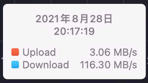

## 写在前面

随着45甲乙的重新修建，~~所有宿舍~~都是千兆网络环境了，如果你有文件共享、影音娱乐、资料下载等需求，或疑惑自己没有体验到千兆网络，不妨看看这篇文章，体验高速上网的乐趣🐶。

## 目录

- 究竟什么是千兆网络？
- 下载文件为什么不到千兆？
- 是否需要自己购买路由器？

## 究竟什么是千兆网络？

### 千兆？125MB/s！

8月28日晚实测

由于单位的不同，要对应日常使用的“网速”，千兆网络（1000Mbps）应当除以8，也即125MB/s，并不是**一秒一个G**。

> 如果上过计算概论，那么这个概念就很好理解了。1000Mbps指 1000 Megabit *per second*，即1000 / 8 = 125 MegaByte *per second*，所以理论最大下行速率是125MB/s。

日常使用或许很难达到这个速度，后文会解释原因。

## 下载文件为什么不到千兆？

啊哈，这很难回答，首先我们来一起排查一下硬件问题。

**校内有线网络才是千兆环境**，目前校内的路由普遍提供百兆带宽。即使是新楼的WIFI6路由，也被计算中心限速在百兆以内。想要使用千兆的上网环境，必须

> ~~关于无线网络的限速，大家进行过一些探索，感兴趣可以后台私信。~~

学校提供的无线网络既不能提供千兆网速，也不能提供低延迟游戏体验。成本最低的办法就使用有线网络

### 没有人能用到125MB/s

我只有两种情景会触碰到125MB/s的瓶颈：下载正版软件平台资源、用SSD硬盘挂载PT站。即使是主流测速网站，也会由于多种情况

